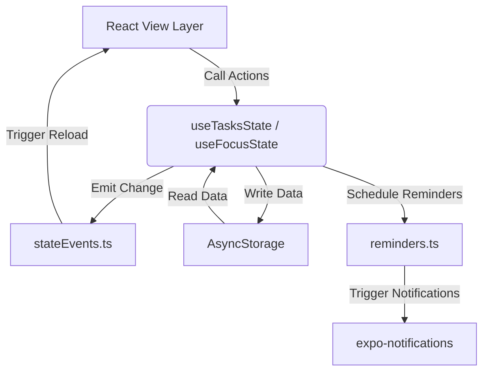

# Architecture Document: Pebble Productivity App

Pebble is designed as a local-first, offline-ready application. It uses a single-tier, React Native client model with AsyncStorage persistence and reactive observer systems.

---

## 1. System Overview

---

## 2. Core Architectural Patterns

### 2.1 Local-First Persistence Pipeline
All data is stored in the user's local device sandbox. AsyncStorage keys are defined centrally in [storage.ts](file:///c:/Users/harsh/OneDrive/Desktop/todoapp/services/storage.ts):
* `todoapp:v1` — Lists and Todos (grouped by list ID).
* `todoapp:daily:v1` — Habit definitions, streaks, and completions.
* `todoapp:history:v1` — Daily productivity completion score logs.
* `todoapp:profile:v1` — Streak info, level, and earned XP.
* `todoapp:settings:v1` — App options (Quiet Hours, Mascot companion active).
* `todoapp:recycle_bin:v1` — Soft-deleted items, automatically garbage collected after 30 days.
* `todoapp:collections:v1` — Reference links, notes, and ideas grouped by workspace list ID.

### 2.2 Global State Change Events
To avoid passing prop callbacks down deep component trees, Pebble uses a lightweight observer pattern in [stateEvents.ts](file:///c:/Users/harsh/OneDrive/Desktop/todoapp/services/stateEvents.ts). 
When components write to AsyncStorage, they call `emitStateChange(event, emitterId)`. Other screens and providers register listeners via `addStateListener(event, callback)` in `useEffect` and invoke cleanup hooks to prevent leaks.

### 2.3 Worklet Thread Safety
Reanimated timing animations run on a separate native UI thread. Attempting to directly mutate React Refs or invoke React state setters (`setIsDismissed`) from within a worklet callback triggers silent UI freezes or native crashes. To solve this, all React mutations must be wrapped in helper functions and called via Reanimated's `runOnJS(callback)()` utility.

---

## 3. Logical Module Specifications

### Module 1: Routing & Shell
* **Purpose**: Manages screen navigation, root styling, theme switching, and onboarding gating.
* **Main Files**: [Root Layout](file:///c:/Users/harsh/OneDrive/Desktop/todoapp/app/_layout.tsx), [Tabs Layout Layout](file:///c:/Users/harsh/OneDrive/Desktop/todoapp/app/(tabs)/_layout.tsx), [Onboarding Screen](file:///c:/Users/harsh/OneDrive/Desktop/todoapp/app/onboarding.tsx).
* **Dependencies**: `expo-router`, `expo-splash-screen`, `@expo-google-fonts/outfit`, `react-native-gesture-handler`.
* **Data Flow**: On app startup, `RootLayout` reads `todoapp:onboarding_completed`. If empty, it pushes the user to `/onboarding`.
* **Important Functions**: `RootLayout` handles font preloading and splash screen dismissal.
* **External Services**: None (fully offline).
* **Current Status**: Stable. Fully styled with Outfit typography.

### Module 2: Planner (Tasks & Habits)
* **Purpose**: Coordinates work list segmentations, tasks checklists, habit streaks, category filtering, and item CRUD operations.
* **Main Files**: [Planner Screen](file:///c:/Users/harsh/OneDrive/Desktop/todoapp/app/(tabs)/tasks.tsx), [useTasksState Hook](file:///c:/Users/harsh/OneDrive/Desktop/todoapp/modules/tasks/useTasksState.ts), [habitService](file:///c:/Users/harsh/OneDrive/Desktop/todoapp/services/habitService.ts).
* **Dependencies**: `@react-native-async-storage/async-storage`, `expo-haptics`, `react-native-gesture-handler`.
* **Data Flow**: `useTasksState` parses URL params for folder filtering, reads task and habit states from storage on focus, completes items via swipe haptics, and logs pebble counts.
* **Important Functions**: `normalizeHabitsForToday` handles daily streak degradation and recovery windows.
* **External Services**: `expo-haptics`.
* **Current Status**: Active. Supports bulk selection, list movements, and swipe completion indicators.

### Module 3: Pebble Capture & NLP Engine
* **Purpose**: Parses plain text to extract structured date/time, category, recurrence, and priorities.
* **Main Files**: [nlpParser Service](file:///c:/Users/harsh/OneDrive/Desktop/todoapp/services/nlpParser.ts), [CaptureInputBox Component](file:///c:/Users/harsh/OneDrive/Desktop/todoapp/components/ui/CaptureInputBox.tsx), [NLPCapture Overlay](file:///c:/Users/harsh/OneDrive/Desktop/todoapp/components/NLPCapture.tsx).
* **Dependencies**: `chrono-node` (date extraction), `compromise` (verb/subject classification).
* **Data Flow**: Triggered in the Quick Add Bottom Sheet. The user types, and `parseProductivityText` debounces the input, running NLP heuristics to update interactive preview pills.
* **Important Functions**: `parseProductivityText` returns parsed tasks or habits with extraction confidence in `<12ms`.
* **External Services**: None (100% offline).
* **Current Status**: Stable. Fully client-side.

### Module 4: Mascot Companion Overlay
* **Purpose**: Displays the Crow companion assistant, summoning/dismissing via shakes, and showing quick recommendations.
* **Main Files**: [MascotOverlay Component](file:///c:/Users/harsh/OneDrive/Desktop/todoapp/components/MascotOverlay.tsx), [quickSuggestions Service](file:///c:/Users/harsh/OneDrive/Desktop/todoapp/services/quickSuggestions.ts).
* **Dependencies**: `expo-sensors` (accelerometer), `react-native-reanimated`, `react-native-svg`.
* **Data Flow**: Listeners monitor tasks, habits, and focus logs. When a pebble is completed, it triggers `handlePebbleCompletedSuggestion` and displays a dangling parchment card with a twine string.
* **Important Functions**: `getSmartQuickSuggestions` rotates relevant workspace suggestions.
* **External Services**: Accelerometer hardware.
* **Current Status**: Enhanced. String physics aligned directly with beak coordinates.

### Module 5: Focus Console & Gamification
* **Purpose**: Deep focus work Pomodoro timer, ambient music, and XP Pebble Jar visualization.
* **Main Files**: [TimerCockpit Component](file:///c:/Users/harsh/OneDrive/Desktop/todoapp/components/focus/TimerCockpit.tsx), [useFocusState Hook](file:///c:/Users/harsh/OneDrive/Desktop/todoapp/components/focus/useFocusState.ts), [PebbleJar Component](file:///c:/Users/harsh/OneDrive/Desktop/todoapp/components/profile/PebbleJar.tsx).
* **Dependencies**: `react-native-reanimated`, `expo-av` (audio player).
* **Data Flow**: Timer updates are written to `todoapp:focus:current_session`. Completing a session triggers `earnPebble`, adding a task/habit/focus pebble log and updating the Pebble Jar.
* **Important Functions**: `earnPebble` increments total XP and awards daily bonus gems.
* **External Services**: Audio subsystem.
* **Current Status**: Stable. Integrates Reanimated breathing rings.

### Module 6: Reminders & Alerts
* **Purpose**: Local task and habit notifications, snooze setups, and alarm banners.
* **Main Files**: [Reminders Service](file:///c:/Users/harsh/OneDrive/Desktop/todoapp/services/reminders.ts), [AlarmModal Component](file:///c:/Users/harsh/OneDrive/Desktop/todoapp/modules/reminders/AlarmModal.tsx).
* **Dependencies**: `expo-notifications`, `expo-intent-launcher`.
* **Data Flow**: Adding tasks/habits with times schedules notification IDs via `scheduleReminderBatch`. Tapping alarm notifications opens the app and launches `AlarmModal`.
* **Important Functions**: `scheduleReminderBatch` schedules alarms, skipping slots that fall inside user-defined Quiet Hours.
* **External Services**: Native OS Notification System.
* **Current Status**: Active. Handles platform fallbacks (Web uses standard timeouts).

### Module 7: Storage & Sync
* **Purpose**: AsyncStorage abstractions, Recycle Bin soft-deletes, and Undo snackbars.
* **Main Files**: [Storage Service](file:///c:/Users/harsh/OneDrive/Desktop/todoapp/services/storage.ts), [UndoContext Provider](file:///c:/Users/harsh/OneDrive/Desktop/todoapp/components/ui/UndoContext.tsx).
* **Dependencies**: `@react-native-async-storage/async-storage`.
* **Data Flow**: Items deleted via lists are saved in the Recycle Bin log. Undo toasts let users reverse the deletion, popping items back into their lists.
* **Important Functions**: `cleanupRecycleBin` clears items older than 30 days.
* **External Services**: AsyncStorage.
* **Current Status**: Stable. Fully handles workspaces, tasks, and habits.

### Module 8: Dashboard & Metrics
* **Purpose**: Summary panels, scrollable weekday calendar strips, and productivity trend charts.
* **Main Files**: [Dashboard Screen](file:///c:/Users/harsh/OneDrive/Desktop/todoapp/app/(tabs)/index.tsx), [PebbleInsightCard Component](file:///c:/Users/harsh/OneDrive/Desktop/todoapp/components/dashboard/PebbleInsightCard.tsx), [productivityHistory](file:///c:/Users/harsh/OneDrive/Desktop/todoapp/services/productivityHistory.ts).
* **Dependencies**: `react-native-calendars`.
* **Data Flow**: Reads daily completion history. Builds graphs representing completion levels, active streaks, and cognitive flow focus peaks.
* **Important Functions**: `recordDailyHistorySnapshot` computes the day's completion score.
* **External Services**: None.
* **Current Status**: Active. Fully displays weekly trends and active stats.

### Module 9: Pebble Knowledge Collections V1
* **Status**: Implemented (V1)
* **Purpose**: Serves as a digital reference repository for passive cognitive items (links, notes, images, files) inside workspace folders, allowing segmented switcher navigation, task projection, and Recycle Bin restoration.
* **Main Files**: [VaultSection](file:///c:/Users/harsh/OneDrive/Desktop/todoapp/modules/vault/VaultSection.tsx), [useTasksState](file:///c:/Users/harsh/OneDrive/Desktop/todoapp/modules/tasks/useTasksState.ts), [PEBBLE_VAULT.md](file:///c:/Users/harsh/OneDrive/Desktop/todoapp/docs/PEBBLE_VAULT.md) (design doc).
* **Dependencies**: `@react-native-async-storage/async-storage`, `chrono-node`, `compromise`.
* **Data Flow**: Items are captured from the Quick Add bottom sheet or folder details Collections tab, mapped optionally to folder IDs (defaulting to "unassigned" Inbox), and persisted in AsyncStorage under `todoapp:collections:v1`. Task conversion copy-projects the reference item into a task within the target folder and awards +10 XP without removing the source item. Soft-deleted collections or items are moved to the Recycle Bin and can be restored.
* **Important Functions**: `createCollection` creates a collection; `addCollectionItem` appends references; `deleteCollection` soft-deletes collections to the Recycle Bin.
* **External Services**: None (fully offline).
* **Current Status**: Implemented (V1). Supports full segmented tabs and Recycle Bin restoration.
